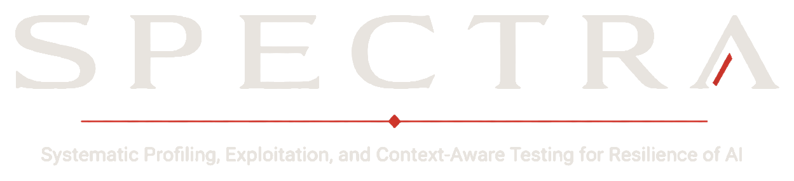

<p align="center">
  
</p>

---

## Overview

SPECTRA is an emerging research framework and service methodology for context-aware AI adversarial testing. It provides a 9-stage pipeline for systematically evaluating the security posture of enterprise AI deployments — from initial reconnaissance through attack chain composition and remediation mapping.

Unlike generic prompt injection testing, SPECTRA treats each AI system as an enterprise asset embedded in a specific industry, regulatory environment, and technical architecture. Test payloads are generated with awareness of the target's sector (NAICS classification), defensive profile, connected tools, data sensitivity hierarchy, and behavioral characteristics.

## What This Repository Contains

This repository includes the public methodology, operating model, framework mappings, and sanitized examples.

- **White paper** — Full methodology description, 9-stage pipeline, operating model, and research foundation
- **Methodology overview** — High-level walkthrough of each pipeline stage
- **Operating model** — How SPECTRA maps to real engagement delivery
- **Framework alignment** — Mapping to OWASP LLM Top 10, MITRE ATLAS, NIST AI RMF, and ISO 42001
- **Data privacy model** — How sensitive data is handled during testing, including the redaction proxy architecture
- **Threat personas** — Sanitized examples of context-aware threat modeling for AI systems
- **Sanitized examples** — Sample target profiles, attack chains, and remediation maps with all identifying data removed

## What Is Not In This Repository

The working orchestration engine, payload generation logic, scoring rules, knowledge base internals, and adaptive testing workflows are maintained privately while the project remains under active research and validation.

| Private Component | Description |
|---|---|
| Orchestration engine | 9-stage pipeline runner with adapter support for OpenAI, Anthropic, Azure, Bedrock, Ollama, and custom APIs |
| Payload generation | Context-aware test generation across 10 outcome categories with sector-specific fill values and 7 evasion strategies |
| Defense fingerprinting | 5-phase probe battery with decision matrix classifier for defensive profile classification (Profiles 1-5) |
| Scoring and classification | NAICS sector signal matching, weighted confidence scoring, multi-sector resolution |
| Safety controls | 4-tier safety gate (SAFE → REAL_CONFIRMED), redaction proxy with 14 pattern categories |
| Attack chain engine | Precondition-outcome mapping, chain composition, business impact quantification |
| Knowledge base | Industry sector profiles, tool interaction libraries, evasion technique details |
| Adaptive testing | Frontier API integration for multi-turn strategy, conversation state management |

## Project Status

SPECTRA is currently maintained as a **public research framework** and **private prototype orchestration system**.

The orchestration engine runs a complete 9-stage pipeline producing structured findings, attack chain analysis, and assessment reports. It supports 8 target adapter types, verbose real-time probe logging, and configurable safety controls. The pipeline is under active validation against lab AI systems.

## Repository Structure

```
spectra/
├── README.md
├── LICENSE-CODE.md              # AGPL-3.0 (code)
├── LICENSE-CONTENT.md           # CC BY-NC-SA 4.0 (content)
├── whitepaper/
│   └── spectra-whitepaper-v1.pdf
├── docs/
│   ├── methodology-overview.md
│   ├── operating-model.md
│   ├── framework-mapping.md
│   ├── data-privacy-model.md
│   └── threat-personas.md
├── examples/
│   ├── sanitized-target-profile.md
│   ├── sample-attack-chain.md
│   └── sample-remediation-map.md
└── assets/
    └── spectra-logo-white-transparent-cropped.png
```

## Framework Coverage

SPECTRA maps findings to four major frameworks:

- **OWASP LLM Top 10 (2025)** — LLM01 through LLM10
- **MITRE ATLAS** — Techniques across reconnaissance, resource development, initial access, execution, persistence, and impact
- **NIST AI RMF** — GOVERN, MAP, MEASURE, MANAGE functions
- **ISO 42001** — Annex A controls for AI management systems

## Author

**Justin Henderson, OSCP+**
Founder, [Black Ledger Security](https://blackledgersecurity.ai)

## License

- **Code**: [AGPL-3.0](LICENSE-CODE.md)
- **Content** (white paper, methodology, knowledge base): [CC BY-NC-SA 4.0](LICENSE-CONTENT.md)

## Contact

For inquiries about SPECTRA methodology, private demonstrations, or collaboration:
- GitHub: [@blackledgersec](https://github.com/blackledgersec)
- Website: [blackledgersecurity.ai](https://blackledgersecurity.ai)
